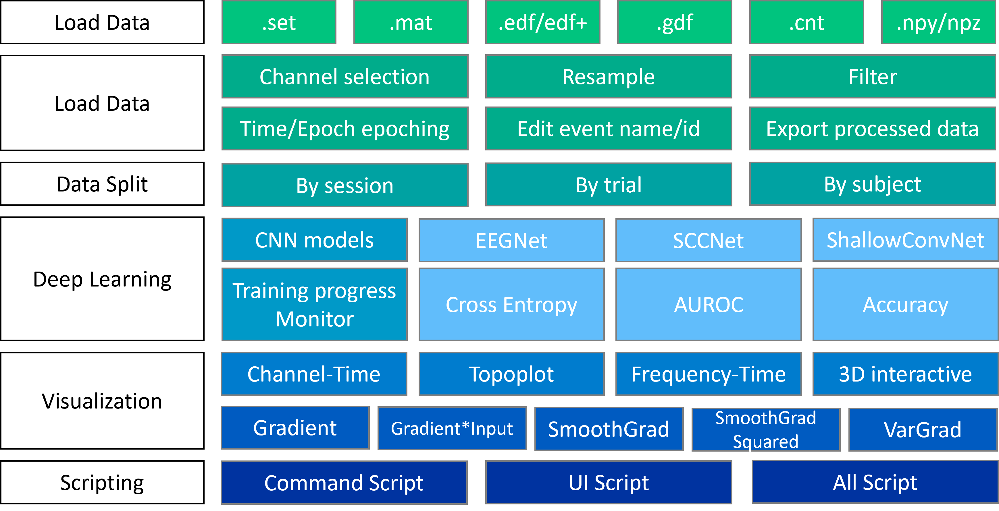

# XBrainLab
[](https://www.python.org/downloads/release/python-390/)
[](https://github.com/CECNL/XBrainLab/blob/main/LICENSE)


XBrainLab is a EEG decoding toolbox with deep learning dedicated to neuroscience discoveries.

## Installation
### From latest code
```
pip install --upgrade git+https://github.com/CECNL/XBrainLab
```

## Getting Started
Type in your terminal, and the GUI application will start automatically.
```
XBrainLab
```
Or run the following code in your python console.
```
from XBrainLab.ui import XBrainLab

lab = XBrainLab()
lab.show_ui()
```
## Quick Overview



## Documentation

TBD

## Citing
If you use XBrainLab to assist you research, please cite our paper and the related references in your publication.

XBrainLab software:
```bash
@inproceedings{
hsieh2023xbrainlab,
title={{XB}rainLab: An Open-Source Software for Explainable Artificial Intelligence-Based {EEG} Analysis},
author={Chia-ying Hsieh and Jing-Lun Chou and Yu-Hsin Chang and Chun-Shu Wei},
booktitle={NeurIPS 2023 AI for Science Workshop},
year={2023},
url={https://openreview.net/forum?id=82brfaM02h}
}
```
SCCNet implementation:
```bash
@inproceedings{wei2019spatial,
  title={Spatial component-wise convolutional network (SCCNet) for motor-imagery EEG classification},
  author={Wei, Chun-Shu and Koike-Akino, Toshiaki and Wang, Ye},
  booktitle={2019 9th International IEEE/EMBS Conference on Neural Engineering (NER)},
  pages={328--331},
  year={2019},
  organization={IEEE}
}
```
EEGNet implementation:
```bash
article{lawhern2018eegnet,
  title={EEGNet: a compact convolutional neural network for EEG-based brain--computer interfaces},
  author={Lawhern, Vernon J and Solon, Amelia J and Waytowich, Nicholas R and Gordon, Stephen M and Hung, Chou P and Lance, Brent J},
  journal={Journal of neural engineering},
  volume={15},
  number={5},
  pages={056013},
  year={2018},
  publisher={iOP Publishing}
}
```
ShallowConvNet implementation:
```bash
@article{schirrmeister2017deep,
  title={Deep learning with convolutional neural networks for EEG decoding and visualization},
  author={Schirrmeister, Robin Tibor and Springenberg, Jost Tobias and Fiederer, Lukas Dominique Josef and Glasstetter, Martin and Eggensperger, Katharina and Tangermann, Michael and Hutter, Frank and Burgard, Wolfram and Ball, Tonio},
  journal={Human brain mapping},
  volume={38},
  number={11},
  pages={5391--5420},
  year={2017},
  publisher={Wiley Online Library}
}
```
